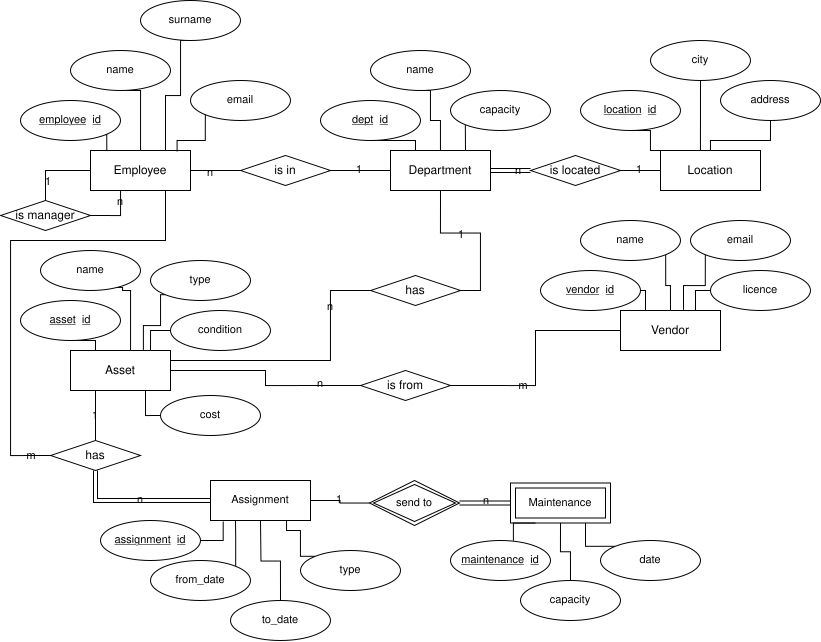
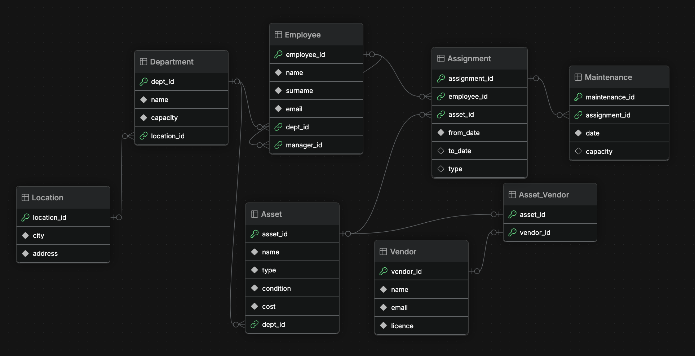
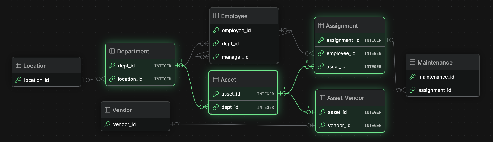
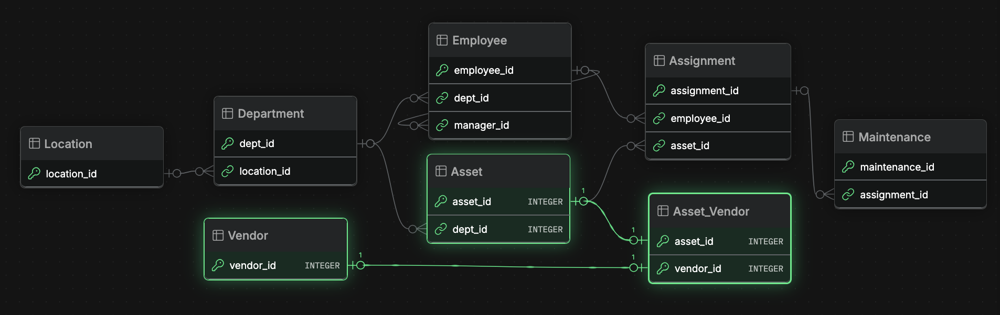
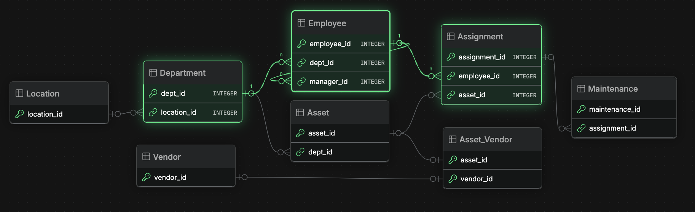
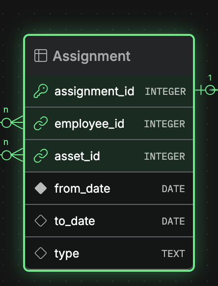
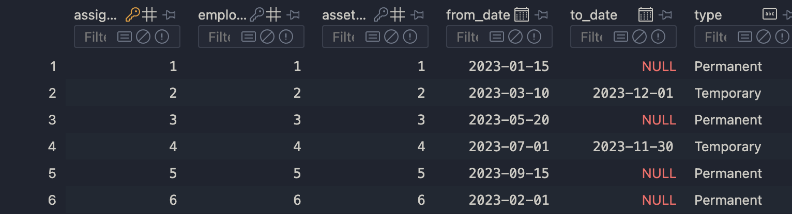
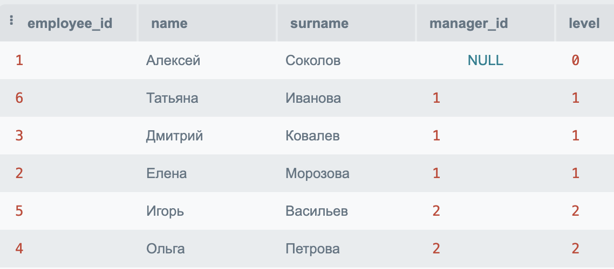
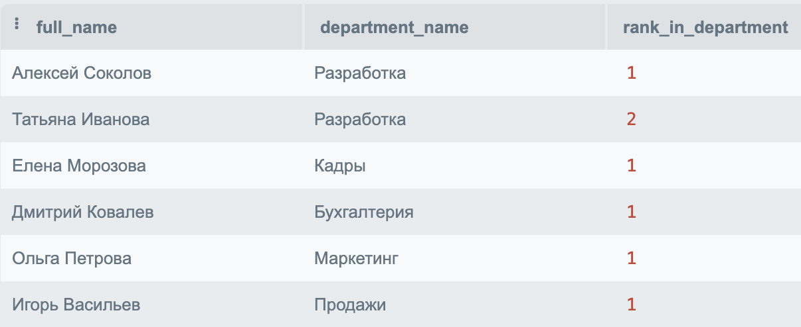
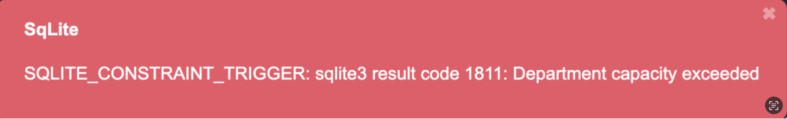

<!-- _class: title-box logo2 -->


# IT Asset Management

<br>

НИУ ВШЭ
г. Москва, 2025

---

<!-- class: box -->


## Цель проекта

Проект посвящен проектированию и разработке базы данных для системы усправления оборудованием (устройство, ноутбуки, периферия) в компании.

Моделирование БД осуществлялось с помощью ERD в нотации Чен (Chen-notaion). Взаимосвязи между таблицами указаны в другой ERD.

**Ключевые слова:** Моделирование, ERD, Архитектура, Аналитика, SQL, Запросы, База данных

См. презентацию [DB-project](DB-project.pdf) для более подробного ознакопления в удобном формате. 

---

## Project goal

The project is devoted to the design and development of a database for the system of equipment management (device, laptops, peripherals) in the company.

The database was modeled using ERD in Chen-notation. The relationships between the tables are specified in another ERD.

**Keywords:** Modeling, ERD, Architecture, Analytics, SQL, Queries, Database

Check out the [DB-project](DB-project.pdf) presentation for more details in a convenient format. 


---

## Инициализация проекта для локального запуска

Создание БД:
```py
python3 -m db.py
```
После этого создастся файл `local.db`. БД создается с помощью `makedb.sql`.

Если Вы используете VS Code, то установите расширение SQLite для совершения запросов к БД.

Запросы, упомянутые здесь и в презентации, есть в файле `queries.sql`: **15+** запросов, где есть агрегирующие функции, подзапросы, CTE, VIEW, триггеры, оконные функции.

Запросы пишутся в файл `queries.sql`.


---
<!-- class: box -->

## Описание БД
**Назначение:** учёт IT-оборудования, сотрудников, отделов, поставщиков, управлениу назначениями оборудования и его обслуживанием (ремонтом).

**Основные цели:**
-	Централизованный учёт IT-активов по отделам и сотрудникам.
-	Прослеживание историй назначений и обслуживания оборудования.
-	Анализ распределения активов по местоположениям и поставщикам.
-	Контроль за состоянием активов (новое, на ремонте и пр.).

**СУБД:** SQLite 3.47.2

---


## DB description
**Purpose:** Accounting of IT equipment, employees, departments, suppliers, management of equipment assignments and its maintenance (repair).

**Main purposes:**
- Centralized accounting of IT assets by departments and employees.
- Tracking of equipment assignment and maintenance histories.
- Analyzing asset allocation by location and vendor.
- Monitor asset status (new, under repair, etc.).

**DBMS:** SQLite 3.47.2


---

<div class="columns">

<div class="column">

**Ожидаемые пользователи:**
- IT-специалисты и администраторы — для учёта оборудования, отслеживания ремонтов, обновлений, закупок.
- Руководители отделов — для просмотра назначений, списков сотрудников, планирования потребностей.
- Аналитики — для построения отчётов о распределении и использовании активов.
</div>

<div class="column">

**Примеры запросов:**
- Поиск всех активов, закреплённых за конкретным сотрудником.
- Список поставщиков, связанных с конкретными типами оборудования.
- Подсчёт количества активов в отделе по состоянию.
- Выявление неиспользуемых активов.
-	История ремонтов по каждому активу.

</div>
</div>

---

Связи: 
-	`Employee-Assignment-Asset` тернарная (n:1:m), где `Employee-Assignment` (m:1), `Assignment-Asset` (n:1), `Employee-Asset`(m:n)
-	`Asset-Vendor` (n:m)
-	`Employee-Department` (n:1)
-	`Department-Location` (n:1)
-	`Department-Asset` (1:n).

Слабая сущность: `Maintenance` (зависит от Assignment).

Рекурсивная связь: `Employee` (отношение "Руководитель-Подчиненный", 1:n)


---
### ER-диаграмма
<!-- _class: box image-slide -->

ERD Chen-notation



---
### ER-диаграмма

<!-- _class: box image-slide -->



---
<!-- _class: box image-slide -->

### Связи Asset



---

<!-- _class: box image-slide -->

### Связи Asset-Vendor



---


<!-- _class: box image-slide -->

### Связи Employee



---

## Нормализация

- Все отношения в 3NF
- Каждый атрибут зависит только от ключа, нет транзитивных зависимостей
- Тернарная связь `Assignment–Employee–Asset` вынесена в отдельную таблицу Assignment
- N:M связь `Asset–Vendor` оформлена отдельной таблицей
- Атрибуты атомарны: поля разделены (city/address, first_name/last_name)
- Слабая сущность `Maintenance` связана через ключ с Assignment ⇒ никакого дублирования
- Отсутствуют агрегатные и вычисляемые поля внутри таблиц

Все нетривиальные зависимости устранены ⇒ достигается 4NF

---
### Создание таблиц

`Assignment`

<div class="columns">
<div class="column">

```sql
CREATE TABLE Assignment (
    assignment_id INTEGER PRIMARY KEY AUTOINCREMENT,
    employee_id INTEGER NOT NULL,
    asset_id INTEGER NOT NULL,
    from_date DATE NOT NULL,
    to_date DATE,
    type TEXT CHECK(type 
      IN ('Permanent', 'Temporary')),
    FOREIGN KEY 
      (employee_id) REFERENCES Employee(employee_id) 
      ON DELETE CASCADE,
    FOREIGN KEY 
      (asset_id) REFERENCES Asset(asset_id) 
      ON DELETE CASCADE
);
```

</div>

<div class="column2">


</div>
</div>

---

### Заполнение таблиц
```sql
INSERT INTO Assignment (employee_id, asset_id, from_date, to_date, type) VALUES
(1, 1, '2023-01-15', NULL, 'Permanent'),
(2, 2, '2023-03-10', '2023-12-01', 'Temporary'),
(3, 3, '2023-05-20', NULL, 'Permanent'),
(4, 4, '2023-07-01', '2023-11-30', 'Temporary'),
(5, 5, '2023-09-15', NULL, 'Permanent'),
(6, 6, '2023-02-01', NULL, 'Permanent');
```

<br>




---

### Некоторые запросы. CTE + рекурсия


```sql
/* Построение иерархии сотрудников, начиная с тех, у кого нет руководителя, 
и рекурсивно добавляет подчинённых с указанием уровня в иерархии.*/
WITH RECURSIVE EmployeeHierarchy AS (
    SELECT employee_id, name, surname, manager_id, 0 AS level -- нач. ур. иерархии
    FROM Employee
    WHERE manager_id IS NULL -- самые верхние в иерархии
    UNION ALL
    SELECT e.employee_id, e.name, e.surname, e.manager_id, eh.level + 1
    FROM Employee e
    INNER JOIN EmployeeHierarchy eh ON e.manager_id = eh.employee_id)
SELECT * FROM EmployeeHierarchy ORDER BY level, surname, name;
```


---
### Некоторые запросы. VIEW


```sql
/* Получить список городов, максимальную вместимость департаментов и 
среднюю стоимость оборудования, которым владеет департамент. Добавить 
столбец big_city (True / False), еслит суммарная  вместимость в городе 
по департаментам не менее 40 человек.
*/
SELECT l.city,  MAX(d.capacity) AS max_capacity, 
  AVG(a.cost) AS avg_asset_cost,
CASE 
  WHen MAX(d.capacity) >= 40 then 'True'
  ELSE 'False'
  END as big_city
FROM Location l
INNER JOIN Department d ON l.location_id = d.location_id
INNER JOIN Asset a ON d.dept_id = a.dept_id
GROUP BY l.city
ORDER BY max_capacity DESC;
```
---

### Некоторые запросы


```sql
/* Нужно создать представление для оборудования и поставщиков, 
затем вывести отчет с количеством оборудования по поставщикам.
*/

CREATE VIEW AssetVendorSummary AS
SELECT a.name AS asset_name, a.type, v.name AS vendor_name
FROM Asset a
INNER JOIN Asset_Vendor av ON a.asset_id = av.asset_id
INNER JOIN Vendor v ON av.vendor_id = v.vendor_id;

SELECT vendor_name, COUNT(asset_name) AS asset_count
FROM AssetVendorSummary
GROUP BY vendor_name
ORDER BY asset_count DESC;
```
VIEW для объединения активов и поставщиков. 
Выводим отчет с количеством активов по поставщикам.

---

### Оконные функции

```sql
/* Для каждого департамента вывести список 
сотрудников с их порядковым номером (по алфавиту имени).*/
SELECT e.name || ' ' || e.surname AS full_name,
    d.name AS department_name,
    ROW_NUMBER() OVER (PARTITION BY e.dept_id 
    ORDER BY e.name, e.surname) AS rank_in_department
FROM Employee e
JOIN Department d ON e.dept_id = d.dept_id;
```
Формируем отчетность по сотрудникам, которые получили оборудование в департаменте.

---
### Оконные функции





---
### Оконные функции

```sql
/* Для каждого актива посчитать, насколько его цена отличается от средней 
по департаменту.*/
SELECT 
    a.name AS asset_name,
    d.name AS department_name,
    a.cost,
    ROUND(AVG(a.cost) OVER (PARTITION BY a.dept_id), 2) AS avg_cost_in_dept,
    ROUND(a.cost - AVG(a.cost) OVER (PARTITION BY a.dept_id), 2) AS diff_from_avg
FROM Asset a
JOIN Department d ON a.dept_id = d.dept_id;
```

Смотрим на отклонение стоимости актива от средней по департаменту может использоваться для оптимизации закупок и выявления нестандартных закупочных решений, если оборудование слишком дорогое / слишком дешевое.

---

### Триггеры

```sql

/* Проверка вместимости департамента: предотвращает добавление сотрудника 
в департамент, если его вместимость уже превышена.*/

CREATE TRIGGER check_department_capacity
BEFORE INSERT ON Employee
FOR EACH ROW
WHEN (
    (SELECT COUNT(*) FROM Employee WHERE dept_id = NEW.dept_id) >=
    (SELECT capacity FROM Department WHERE dept_id = NEW.dept_id)
)
BEGIN
    SELECT RAISE(FAIL, 'Department capacity exceeded');
END;

```

---
### Проверка

```sql
INSERT INTO Department (name, capacity, location_id) VALUES
('Аналитика', 2, 1);


INSERT INTO Employee (name, surname, email, dept_id, manager_id) VALUES
('Илья', 'Желтый', 'yellow@example.com', 6, NULL),
('Кирилл', 'Зеленый', 'green@example.com', 6, 1),
('Михайло', 'Оранжевый', 'orange@example.com', 6, 1); -- вылезет ошибка
```


---

### Триггеры

```sql
/* Триггер для обновления состояния актива на 'Working' 
после записи об обслуживании. После добавления записи в Maintenance 
триггер автоматически обновляет состояние актива на 'Working', если ранее 
оно было 'Repair'*/

CREATE TRIGGER update_asset_condition
AFTER INSERT ON Maintenance
FOR EACH ROW
BEGIN
    UPDATE Asset
    SET condition = 'Working'
    WHERE asset_id = (
        SELECT asset_id 
        FROM Assignment 
        WHERE assignment_id = NEW.assignment_id
    )
    AND condition = 'Repair';
END;
```

---

## Итоги по запросам
- 16 запросов, куда входят 1 CTE c рекурсией для построения иерархии, 1 VIEW.

- 2 запроса с триггерами: один – для проверки вместимости департамента (нельзя добавить сотрудников больше, чем может быть в департаменте), второй – для обновления состояния актива после его обслуживания.

- 3 оконные функции.

См. файлы [queries](queries.sql).

---

## Перспективы развития

- Добавить более сложные связи между сущностями
- Автоматизировать отчётность по оборудованию
- Реализовать визуализацию аналитики (графики, дашборды)

Автоматизация и визуализация выходят за рамки курса, но интересны для дальнейшего развития проекта

---

<!-- _class: title-box -->

